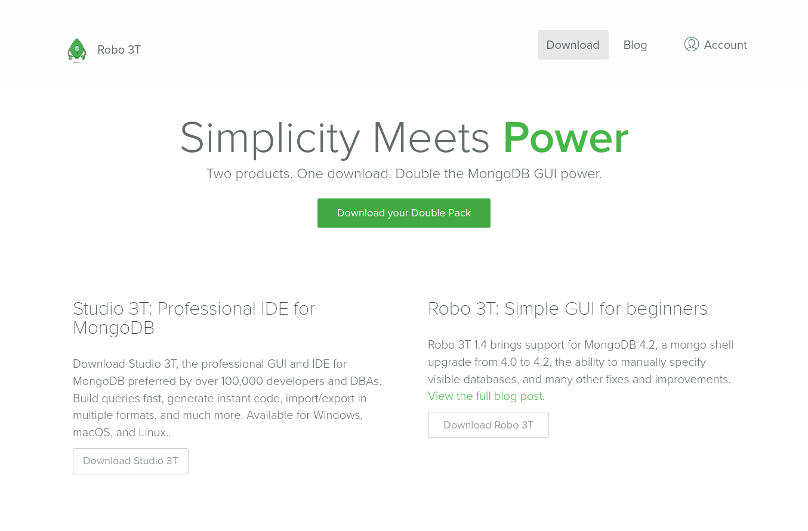
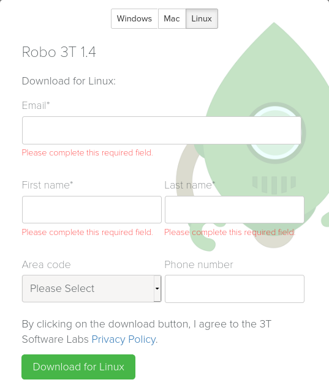
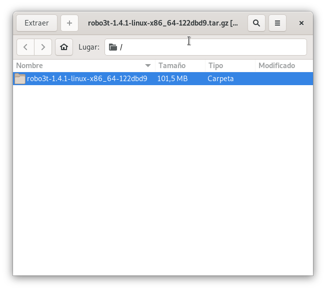
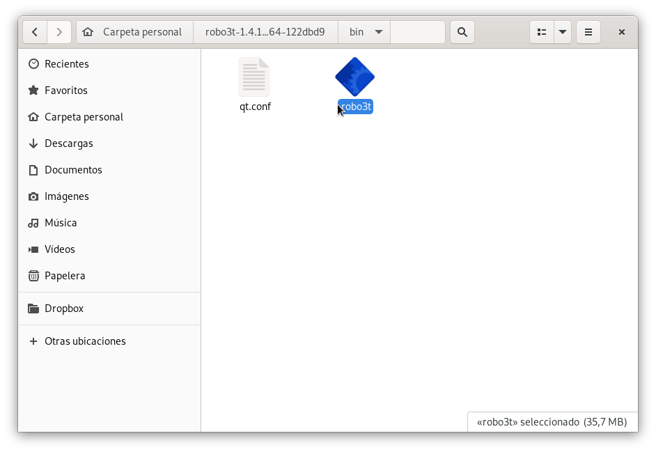
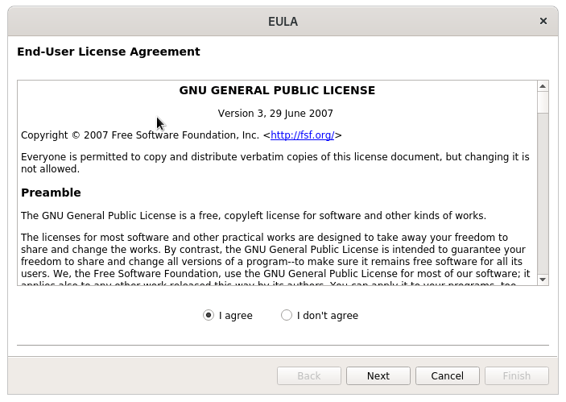
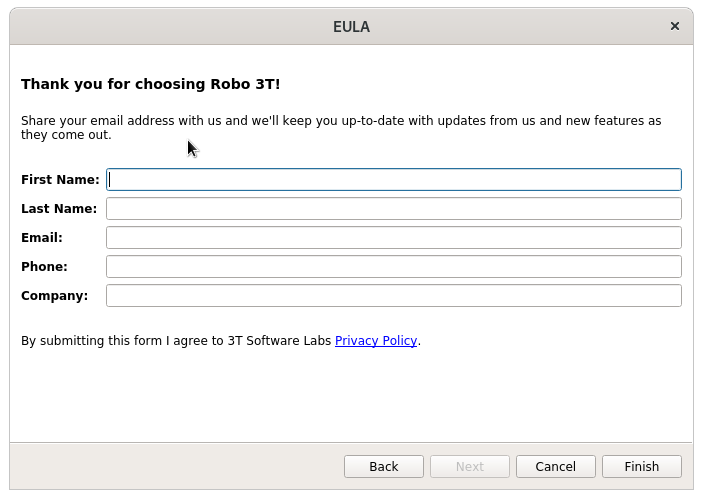
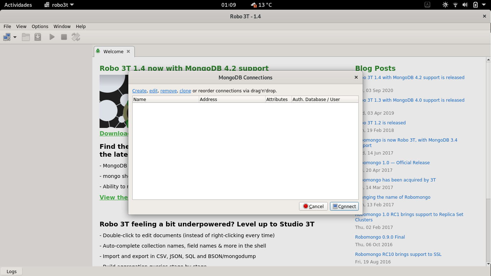
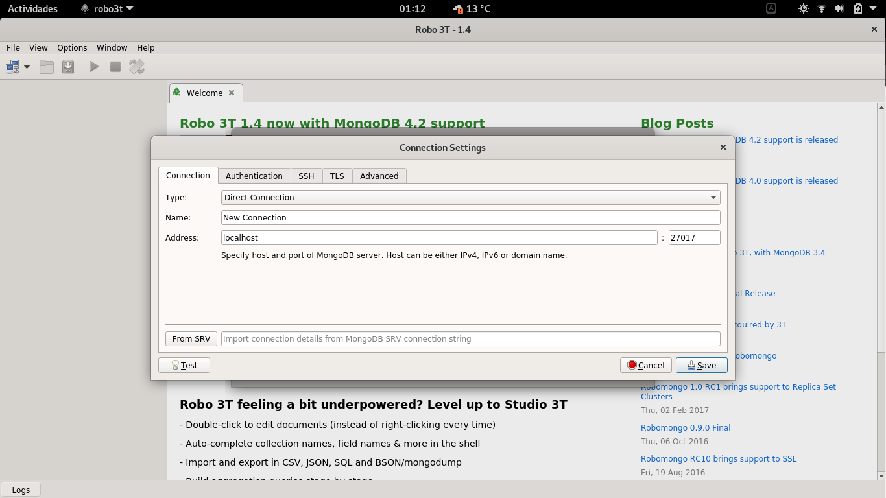
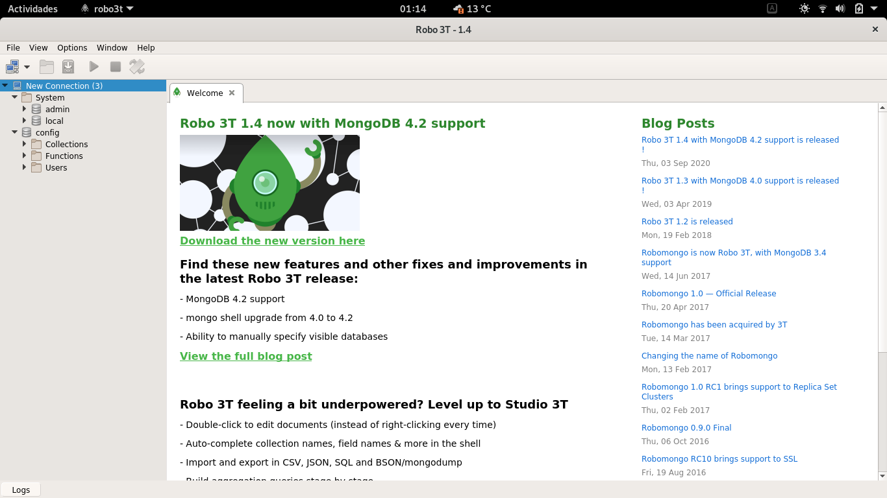

# Ejercicio 1: Instalación de MongoDB
## Autora: Almudena García Jurado-Centurión

### 1. Escribe un informe, a modo de manual, del proceso de instalación

Nos basamos en la documentación oficial, disponible en
https://docs.mongodb.com/manual/tutorial/install-mongodb-on-debian/

En nuestro caso, seguiremos los pasos indicados para Debian 10.

#### Añadiendo el repositorio

Configuramos la firma del repositorio para que `apt` nos lo marque como válido

	wget -qO - https://www.mongodb.org/static/pgp/server-4.4.asc | sudo apt-key add -

Añadimos el repositorio, copiando la siguiente línea en `/etc/apt/sources.list`

	deb http://repo.mongodb.org/apt/debian buster/mongodb-org/4.4 main
	
Actualizamos el índice de repositorios

	sudo apt update	

#### Instalando MongoDB
	    
Una vez añadido el repositorio, instalamos MongoDB desde apt, instalando el paquete `mongodb-org`.

	sudo apt install mongodb-org

Esto descargará e instalará la última versión de MongoDB, junto a las dependencias necesarias para su funcionamiento

#### Arrancando el servidor

Iniciamos el servidor, arrancando el servicio desde SystemD, con el comando:

	sudo systemctl start mongod

Comprobamos que el servicio ha arrancado correctamente

	● mongod.service - MongoDB Database Server
	     Loaded: loaded (/lib/systemd/system/mongod.service; enabled; vendor preset: enabled)
	     Active: active (running) since Tue 2020-10-27 20:51:29 CET; 19min ago
	       Docs: https://docs.mongodb.org/manual
	   Main PID: 696 (mongod)
	     Memory: 213.1M
	     CGroup: /system.slice/mongod.service
	             └─696 /usr/bin/mongod --config /etc/mongod.conf
	
	oct 27 20:51:29 debian systemd[1]: Started MongoDB Database Server.

Vemos que el servicio ha arrancado correctamente

Configuramos el servidor para que se arranque siempre al iniciar el sistema

	sudo systemctl enable mongod

#### Probando la shell

Abrimos la shell, escribiendo en la terminal el comando `mongo`

	almu@debian:~$ mongo
	MongoDB shell version v4.4.1
	connecting to: mongodb://127.0.0.1:27017/?compressors=disabled&gssapiServiceName=mongodb
	Implicit session: session { "id" : UUID("979dac61-4387-4893-b82a-6792260ef784") }
	MongoDB server version: 4.4.1
	---
	The server generated these startup warnings when booting: 
	        2020-10-27T20:51:29.916+01:00: ***** SERVER RESTARTED *****
	        2020-10-27T20:51:29.998+01:00: Using the XFS filesystem is strongly recommended with the WiredTiger storage engine. See http://dochub.mongodb.org/core/prodnotes-filesystem
	        2020-10-27T20:51:31.034+01:00: Access control is not enabled for the database. Read and write access to data and configuration is unrestricted
	        2020-10-27T20:51:31.034+01:00: /sys/kernel/mm/transparent_hugepage/enabled is 'always'. We suggest setting it to 'never'
	---
	---
	        Enable MongoDB's free cloud-based monitoring service, which will then receive and display
	        metrics about your deployment (disk utilization, CPU, operation statistics, etc).
	
	        The monitoring data will be available on a MongoDB website with a unique URL accessible to you
	        and anyone you share the URL with. MongoDB may use this information to make product
	        improvements and to suggest MongoDB products and deployment options to you.
	
	        To enable free monitoring, run the following command: db.enableFreeMonitoring()
	        To permanently disable this reminder, run the following command: db.disableFreeMonitoring()
	---
	> 

Vemos que la shell arranca, aunque con algunos warning

### 2. Cambia  la  carpeta  en  la  que  se  almacenarán  las  bases  de  datos  y  elige  una  propia.  

#### Creando el directorio

Creamos el directorio en la ruta `/usr/local` con el nombre `mongodb-data`

	mkdir /usr/local/mongodb-data

#### Asignando permisos

Para que MongoDB pueda acceder y operar sobre el directorio, cambiamos el propietario del mismo al usuario de mongodb

##### Encontrando el usuario y grupo de MongoDB

Buscamos el nombre del usuario en el fichero `/etc/passwd`

	almu@debian:~$ grep mongo /etc/passwd
	mongodb:x:119:65534::/home/mongodb:/usr/sbin/nologin

Vemos que el usuario se llama `mongodb`. Ahora buscamos el grupo al que pertenece dicho usuario:

	almu@debian:~$ grep mongodb /etc/group
	mongodb:x:126:mongodb

Vemos que el usuario `mongodb` pertenece al grupo `mongodb`

##### Cambiando el propietario del directorio

Usamos el comando `chown` para cambiar el propietario del directorio al usuario `mongodb`, del grupo `mongodb`

	sudo chown -R mongodb:mongodb /usr/local/mongodb-data

Con esto, MongoDB ya debería tener permisos para operar sobre el directorio

#### Asignando el nuevo directorio dentro de la configuración

Editamos el fichero de configuración de MongoDB, alojado en `/etc/mongod.conf`
Modificamos la variable `dbPath` para indicar el nuevo directorio. 

	dbPath: /usr/local/mongodb-data

El fichero de configuración queda así

	# mongod.conf
	
	# for documentation of all options, see:
	#   http://docs.mongodb.org/manual/reference/configuration-options/
	
	# Where and how to store data.
	storage:
	  #dbPath: /var/lib/mongodb
	  dbPath: /usr/local/mongodb-data
	  journal:
	    enabled: true
	#  engine:
	#  mmapv1:
	#  wiredTiger:
	
	# where to write logging data.
	systemLog:
	  destination: file
	  logAppend: true
	  path: /var/log/mongodb/mongod.log
	
	# network interfaces
	net:
	  port: 27017
	  bindIp: 127.0.0.1
	
	
	# how the process runs
	processManagement:
	  timeZoneInfo: /usr/share/zoneinfo
	
	#security:
	
	#operationProfiling:
	
	#replication:
	
	#sharding:
	
	## Enterprise-Only Options:
	
	#auditLog:
	
	#snmp:

#### Reiniciando el servicio

Reiniciamos el servidor de MongoDB para que cargue la nueva configuración

	sudo systemctl restart mongod

#### Comprobando 

##### Comprobando el estado del servicio

Revisamos el estado del servicio desde systemd

	almu@debian:~$ sudo systemctl status mongod
	[sudo] password for almu: 
	● mongod.service - MongoDB Database Server
	     Loaded: loaded (/lib/systemd/system/mongod.service; enabled; vendor preset: enabled)
	     Active: active (running) since Tue 2020-10-27 22:13:06 CET; 40min ago
	       Docs: https://docs.mongodb.org/manual
	   Main PID: 6455 (mongod)
	     Memory: 80.0M
	     CGroup: /system.slice/mongod.service
	             └─6455 /usr/bin/mongod --config /etc/mongod.conf
	
	oct 27 22:13:06 debian systemd[1]: Started MongoDB Database Server.

Vemos que el servidor se ha reiniciado correctamente y está activo

##### Abriendo la shell

Abrimos la shell para comprobar que la conexión funciona correctamente

	almu@debian:~$ mongo
	MongoDB shell version v4.4.1
	connecting to: mongodb://127.0.0.1:27017/?compressors=disabled&gssapiServiceName=mongodb
	Implicit session: session { "id" : UUID("05f42972-d339-454a-bcad-053effb0ed5f") }
	MongoDB server version: 4.4.1
	---
	The server generated these startup warnings when booting: 
	        2020-10-27T22:13:06.390+01:00: ***** SERVER RESTARTED *****
	        2020-10-27T22:13:06.404+01:00: Using the XFS filesystem is strongly recommended with the WiredTiger storage engine. See http://dochub.mongodb.org/core/prodnotes-filesystem
	        2020-10-27T22:13:06.977+01:00: Access control is not enabled for the database. Read and write access to data and configuration is unrestricted
	        2020-10-27T22:13:06.977+01:00: /sys/kernel/mm/transparent_hugepage/enabled is 'always'. We suggest setting it to 'never'
	---
	---
	        Enable MongoDB's free cloud-based monitoring service, which will then receive and display
	        metrics about your deployment (disk utilization, CPU, operation statistics, etc).
	
	        The monitoring data will be available on a MongoDB website with a unique URL accessible to you
	        and anyone you share the URL with. MongoDB may use this information to make product
	        improvements and to suggest MongoDB products and deployment options to you.
	
	        To enable free monitoring, run the following command: db.enableFreeMonitoring()
	        To permanently disable this reminder, run the following command: db.disableFreeMonitoring()
	---
	> 

Vemos que la shell ha abierto correctamente

### 3. Desde el shell de MongoDB, escribe los comandos necesarios para realizar las siguientes consultas:

- **¿A qué base de datos se conecta por defecto?**

		> db
		test

- **¿En qué dirección IP está ejecutándose MongoDB y desde qué puerto está escuchando?**

		> db.getMongo()
		connection to 127.0.0.1:27017

- **¿Qué versión de MongoDB se está ejecutando?**

		> db.version()
		4.4.1

- **Mostrar todas las bases de datos**

		> show dbs
		admin   0.000GB
		config  0.000GB
		local   0.000GB

- **Listar las colecciones de la base de datos "test"**

		> show collections test

- **Cambiar a la base de datos "local" y listar sus colecciones**

		> use local
		switched to db local
		> show collections
		startup_log

### 4. Descarga e instala una GUI para MongoDB

En nuestro caso, vamos a instalar Robo3T en nuestro sistema Debian GNU/Linux.

#### Descarga de Robo 3T

##### Desde la página oficial

Podemos descargarlo desde la página principal, en https://robomongo.org/download , pulsando en "Download Robo 3T". 

Esto nos abrirá un formulario de registro. Lo rellenamos, elegimos el sistema para el que lo queremos descargar, y pulsamos en el botón 

En nuestro caso, seleccionamos "Linux", y pulsamos en el botón "Download for Linux".
Si todo ha ido bien, se nos descargará un fichero en formato tar.gz

##### Desde el repositorio de GitHub

Si queremos evitar el registro, podemos descargar el fichero desde las RELEASES de su repositorio de GitHub, en https://github.com/Studio3T/robomongo/releases

Debemos buscar la última versión estable, descartando aquellas que aparezcan en beta

En nuestro caso, vamos a seleccionar la versión 1.4.1, en https://github.com/Studio3T/robomongo/releases/tag/v1.4.1

Pulsamos en "Assets" para desplegar los ficheros de descarga.

Para GNU/Linux, descargamos el fichero con extensión tar.gz

#### Instalación 

En el caso de GNU/Linux, simplemente extraemos el fichero tar.gz en un directorio

Abrimos el directorio donde lo hemos extraído, y entramos en el directorio `bin/`

Pulsamos en el fichero "robo3t", que nos abrirá el instalador.

El primer paso es el acuerdo de licencia. Marcamos "I agree", y luego pulsamos en "Next".

Nos aparecerá un formulario, donde se nos pedirán nuestros datos. Estos servirán para ofrecer actualizaciones. Si no queremos rellenarlos, pulsamos en "Finish" para terminar.

#### Probando Robo3T

Tras pulsar el botón de "Finish" en el instalador, se nos abrirá la ventana principal de Robo3T.

En el asistente inicial, podemos pulsar en "Create" para crear una nueva conexión.

Dejamos los parámetros por defecto, y pulsamos en "Save".

Nos aparecerá una nueva conexión, con los parámetros por defecto almacenados en nuestro servidor de MongoDB.

Vemos como aparecen las bases de datos que encontramos previamente en la shell.

##### Volviendo a abrir Robo3T

Y con esto ya tenemos instalado Robo3T. Para abrirlo de nuevo, simplemente tenemos que volver al directorio `bin/` y pulsar en el fichero `robo3t`. Esta vez, en lugar del instalador, se nos abrirá la ventana principal de la aplicación.

